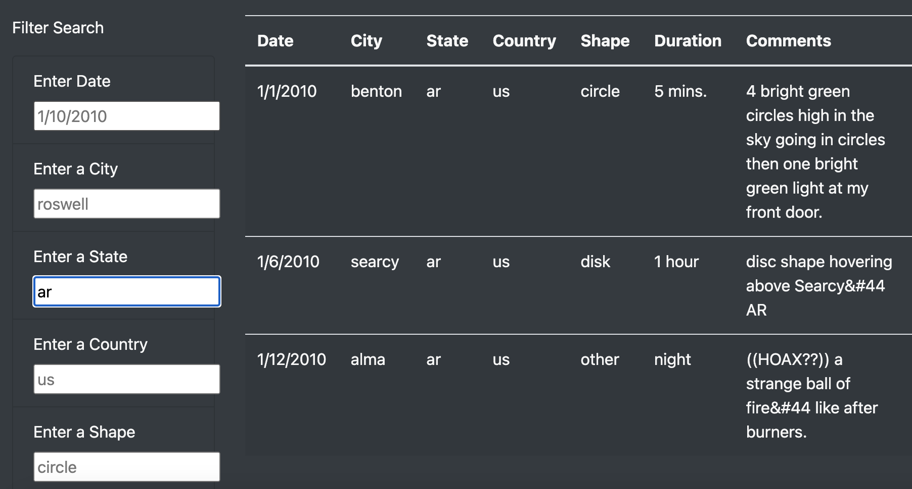

# UFOs

## Purpose & Overview

The purpose of this project is to create a webpage that clearly displays data about UFO sightings and filters the data according to certain parameters such as the date, city, state, country, and shape. This way, visitors to the site can choose to only read about the number of cases in a certain locality or time period. To make this website work properly, I had to use an html file that drew data from two JavaScript files, one containing all the data needed for the site and the other containing the application that would make the site work.

## Results

As a result of adding the filters, the site itself was able to come alive and not just be a display case for facts and pictures. Much like the web scaper, the site would respond to the user's input and display the appropriate data in accordance to the user's input. In the practice version, the site required the clicking of a button; however, using a series of functions, we were able to eliminate the need for a button altogether. Additionally, the previous version only allowed one to filter the data by date. The updated version now allows the user to filter the data by every other metric acvailable on the site. 

## Analysis

To test the functionality of the filter functions, I first tried filtering the data by date to make sure that the previous filter that I had created in the practice code still worked. After that, I filtered the data to only display sightings in the state of Arkansas. I then further narrowed the search to find only disk-shaped UFOs sighted in Arkansas and the search results narrowed to a single case, indicating that the filter works well even with numerous criteria applied.

