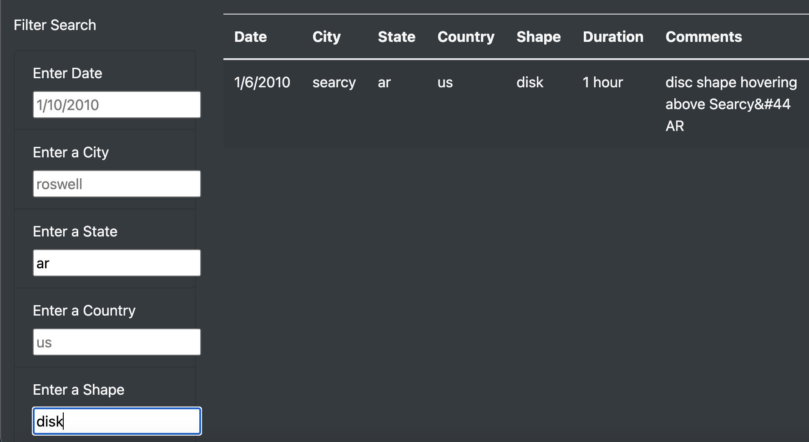

# UFOs

## Tools Used

• JavaScript

• HTML

• CSS

• Visual Studio Code

## Purpose & Overview

The objective of this project is to develop a user-friendly webpage that presents comprehensive information regarding UFO sightings, allowing users to effortlessly filter the data based on specific parameters like date, city, state, country, and shape. This interactive functionality empowers visitors to focus on reading about the number of cases within their desired locality or time frame.

To ensure the seamless functionality of the website, I incorporated an HTML file that seamlessly integrates with two JavaScript files. One JavaScript file encompasses all the necessary data required for the site, while the other JavaScript file houses the application responsible for enabling the site's dynamic functionality.

By employing this setup, users can easily navigate through the webpage, access the relevant UFO sighting data, and leverage the filtering capabilities to cater to their specific interests. The end result is an intuitive and informative website that enhances the user experience and facilitates personalized exploration of UFO sightings.

## Results

As a result of adding the filters, the site itself was able to come alive and not just be a display case for facts and pictures. Much like the web scaper, the site would respond to the user's input and display the appropriate data in accordance to the user's input. In the practice version, the site required the clicking of a button; however, using a series of functions, we were able to eliminate the need for a button altogether. Additionally, the previous version only allowed one to filter the data by date. The updated version now allows the user to filter the data by every other metric acvailable on the site. 

## Analysis

To test the functionality of the filter functions, I first tried filtering the data by date to make sure that the previous filter that I had created in the practice code still worked. After that, I filtered the data to only display sightings in the state of Arkansas. I then further narrowed the search to find only disk-shaped UFOs sighted in Arkansas and the search results narrowed to a single case, indicating that the filter works well even with numerous criteria applied.

